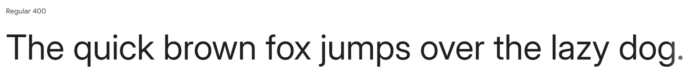
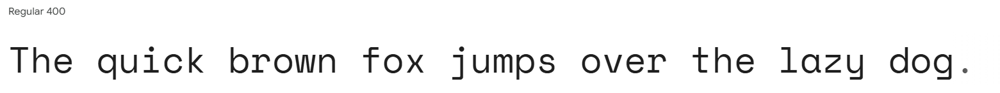

# [Jitendotexe Portfolio](https://jitenadhikari.com.np)

This is the **source code** for my personal portfolio website.

<p align="center">
  <a href="https://jitenadhikari.com.np" target="_blank">
    
  </a>
</p>

<p align="center">
  <a href="https://jitenadhikari.com.np" target="_blank">Live Site</a> •
  <a href="https://github.com/jitenadk/portfolio_site_v2.1" target="_blank">Source Code</a>
</p>

<p align="center">
  
  
  
  
  
  
  
</p>

---

## Table of Contents

- [Design](#design)
  - [Fonts](#fonts)
  - [Color Scheme](#color-scheme)
- [Tech I Used](#tech-i-used)
- [Getting Started](#getting-started)
- [Deployment (Azure)](#deployment-azure)
- [Creator](#creator)
- [License](#license)

---

## Design

### Fonts

- **Inter** – primary sans-serif font (via `next/font/google`)
    <p align="center">
      
    </p>

- **Space Mono** – monospaced code font (via `next/font/google`)
    <p align="center">
      
    </p>

### Color Scheme

- `--background`: #FAFAFA
- `--foreground`: #0A0A0A
- `--primary`: #17E9D1
- `--accent`: #FF2DA0
- `--cyber-green`: #17e98b
- `--secondary`: #E5E7EB
- `--muted`: #E5E7EB
- `--destructive`: #F14A4A
- `--border`/`--input`: #E4E7EF
- `--ring`: #17E9D1
<p align="center">
    <a href="https://coolors.co/fafafa-0a0a0a-17e9d1-ff2da0-17e98b-e5e7eb-f14a4a" target="_blank"></a>
</p>

---

## Tech I Used

- **HTML5**
- **CSS3**
- **JavaScript**
- **TypeScript**
- **React 18**
- **Next.js 15 (App Router)**
- **Tailwind CSS 3.4**
- **Framer Motion**
- **Lucide React** & **React Icons**
- **Biome**, **ESLint**, **Stylelint**
- **Azure Static Web App**
- **Caddy Web Server**
- **Git**

---

## Getting Started

1. Clone the repo:

   ```bash
   git clone https://github.com/jitenadk/portfolio_site_v2.1.git
   cd portfolio_site_v2.1
   ```

2. Install dependencies:

   ```bash
   npm install
   # or yarn install
   ```

3. Start development server:

   ```bash
   npm run dev
   # or yarn dev
   ```

4. Visit [http://localhost:3000](http://localhost:3000).

---

## Creator

**Jiten Adhikari**

<p align="left">
  <a href="mailto:jitenadhikari001@gmail.com"></a>
  <a href="https://github.com/jitenadk" target="_blank"></a>
  <a href="https://www.linkedin.com/in/jitenadk/" target="_blank"></a>
</p>

Forks welcome—please update content & credits.

---

## License

&copy; 2024–<script>document.write(new Date().getFullYear());</script> Jiten Adhikari

Licensed under the [MIT License](./LICENSE).
